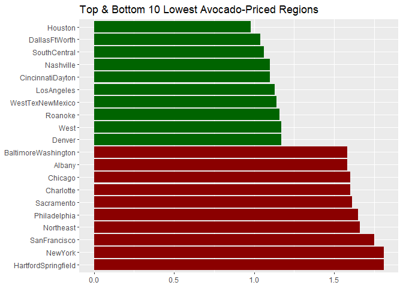
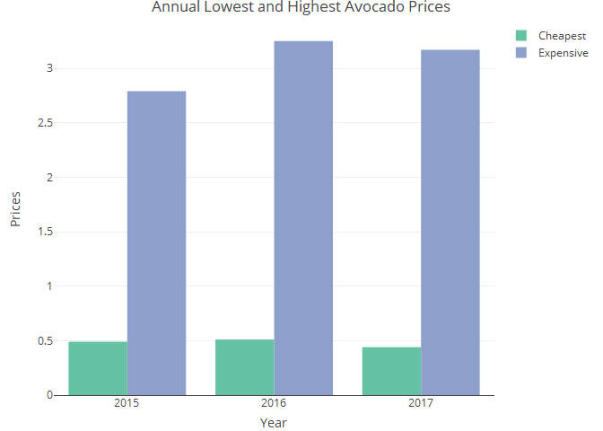
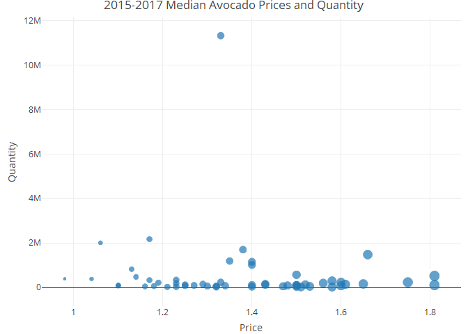

Avocado Prices Case Study
================
Leopoldine Mirtil

### Source

This analysis uses the [Avocado
Prices](https://www.kaggle.com/datasets/neuromusic/avocado-prices) data
set which was made publicly available by Justin Kiggins on Kaggle.com.
It contains historical data about avocado prices and sales throughout
the United States.

### Objective

The following tasks:

1.  Identify the cities that had the cheapest and most expensive prices
    per year
2.  Determine the average price and sales by type
3.  Find the top 10 cities with the overall lowest and highest prices
4.  Analyze the relationship between prices and quantity

## Import Data

### Step 1 - Import Data

#### Load Library

``` r
library(tidyr)
library(tidyverse)
library(dplyr)
library(knitr)
library(ggplot2)
library(lubridate)
library(plotly)
```

#### Set Directory & Import Data

``` r
df <- read.csv('avocado.csv')
```

### Step 2 - Clean Data

``` r
#drop index column
df <- df[-c(1)]

#change data type of date 
df$Date <- as.Date(df$Date)

#add Col
df$Sales = df$AveragePrice * df$Total.Volume

#rename cols 
df <- rename(df, TotalQuantity=Total.Volume, TotalBags=Total.Bags, SmallBags=Small.Bags, LargeBags=Large.Bags, 
             XLargeBags=XLarge.Bags, Type=type, Year=year, Region=region)

#remove PLU cols 
df <- df[-c(4:6)] 
```

### Step 3 - Inspect Data

#### Check for Missing/Null Values

``` r
sapply(df, function(x) sum(is.na(x)))
```

    ##          Date  AveragePrice TotalQuantity     TotalBags     SmallBags 
    ##             0             0             0             0             0 
    ##     LargeBags    XLargeBags          Type          Year        Region 
    ##             0             0             0             0             0 
    ##         Sales 
    ##             0

#### Check for Empty Values

``` r
sapply(df, function(x) sum(x==""))
```

    ##          Date  AveragePrice TotalQuantity     TotalBags     SmallBags 
    ##            NA             0             0             0             0 
    ##     LargeBags    XLargeBags          Type          Year        Region 
    ##             0             0             0             0             0 
    ##         Sales 
    ##             0

#### Check Date Ranges per Year

``` r
df %>%
  group_by(Year) %>%
  reframe(DateRange = range(Date)) %>%
  arrange(Year)
```

    ## # A tibble: 8 × 2
    ##    Year DateRange 
    ##   <int> <date>    
    ## 1  2015 2015-01-04
    ## 2  2015 2015-12-27
    ## 3  2016 2016-01-03
    ## 4  2016 2016-12-25
    ## 5  2017 2017-01-01
    ## 6  2017 2017-12-31
    ## 7  2018 2018-01-07
    ## 8  2018 2018-03-25

#### Remove Rows

``` r
#remove 2018 rows
df <- df[!(df$Year %in% 2018),]

#confirm removal
unique(df$Year)
```

    ## [1] 2015 2016 2017

#### View Modified Dataframe

``` r
str(df)
```

    ## 'data.frame':    16953 obs. of  11 variables:
    ##  $ Date         : Date, format: "2015-12-27" "2015-12-20" ...
    ##  $ AveragePrice : num  1.33 1.35 0.93 1.08 1.28 1.26 0.99 0.98 1.02 1.07 ...
    ##  $ TotalQuantity: num  64237 54877 118220 78992 51040 ...
    ##  $ TotalBags    : num  8697 9506 8145 5811 6184 ...
    ##  $ SmallBags    : num  8604 9408 8042 5677 5986 ...
    ##  $ LargeBags    : num  93.2 97.5 103.1 133.8 197.7 ...
    ##  $ XLargeBags   : num  0 0 0 0 0 0 0 0 0 0 ...
    ##  $ Type         : chr  "conventional" "conventional" "conventional" "conventional" ...
    ##  $ Year         : int  2015 2015 2015 2015 2015 2015 2015 2015 2015 2015 ...
    ##  $ Region       : chr  "Albany" "Albany" "Albany" "Albany" ...
    ##  $ Sales        : num  85435 74084 109945 85312 65331 ...

### Step 4 - Analyze Data

#### Descriptive Analysis

``` r
summary(df)
```

    ##       Date             AveragePrice  TotalQuantity        TotalBags       
    ##  Min.   :2015-01-04   Min.   :0.44   Min.   :      85   Min.   :       0  
    ##  1st Qu.:2015-10-04   1st Qu.:1.10   1st Qu.:   10460   1st Qu.:    4558  
    ##  Median :2016-07-03   Median :1.37   Median :  104849   Median :   38480  
    ##  Mean   :2016-07-02   Mean   :1.41   Mean   :  834110   Mean   :  228965  
    ##  3rd Qu.:2017-04-02   3rd Qu.:1.67   3rd Qu.:  423186   3rd Qu.:  105615  
    ##  Max.   :2017-12-31   Max.   :3.25   Max.   :61034457   Max.   :16298296  
    ##    SmallBags          LargeBags         XLargeBags           Type          
    ##  Min.   :       0   Min.   :      0   Min.   :     0.0   Length:16953      
    ##  1st Qu.:    2466   1st Qu.:    113   1st Qu.:     0.0   Class :character  
    ##  Median :   25200   Median :   2479   Median :     0.0   Mode  :character  
    ##  Mean   :  174844   Mean   :  51202   Mean   :  2918.6                     
    ##  3rd Qu.:   79805   3rd Qu.:  20433   3rd Qu.:    96.4                     
    ##  Max.   :12567156   Max.   :4324231   Max.   :551693.7                     
    ##       Year         Region              Sales         
    ##  Min.   :2015   Length:16953       Min.   :     134  
    ##  1st Qu.:2015   Class :character   1st Qu.:   16485  
    ##  Median :2016   Mode  :character   Median :  135105  
    ##  Mean   :2016                      Mean   :  911449  
    ##  3rd Qu.:2017                      3rd Qu.:  503490  
    ##  Max.   :2017                      Max.   :51550375

#### Summary Statistics of Region Prices

``` r
df %>%
  group_by(Region) %>%
  summarise(MinPrice=min(AveragePrice),
            MeanPrice=round(mean(AveragePrice),2),
            MedianPrice = round(median(AveragePrice), 2),
            MaxPrice=max(AveragePrice)) %>%
  arrange(MinPrice) 
```

    ## # A tibble: 54 × 5
    ##    Region           MinPrice MeanPrice MedianPrice MaxPrice
    ##    <chr>               <dbl>     <dbl>       <dbl>    <dbl>
    ##  1 CincinnatiDayton     0.44      1.2         1.1      2.2 
    ##  2 PhoenixTucson        0.46      1.23        1.23     2.62
    ##  3 Detroit              0.48      1.28        1.25     2.08
    ##  4 Houston              0.51      1.05        0.98     1.92
    ##  5 Nashville            0.51      1.21        1.1      2.24
    ##  6 Columbus             0.52      1.26        1.18     2.22
    ##  7 WestTexNewMexico     0.52      1.26        1.14     2.93
    ##  8 LosAngeles           0.53      1.21        1.13     2.44
    ##  9 Jacksonville         0.54      1.52        1.47     2.99
    ## 10 LasVegas             0.54      1.38        1.27     3.03
    ## # ℹ 44 more rows

#### Annual Minimum & Maximum Prices

``` r
df %>%
  group_by(Year, Region) %>%
  summarise(PriceRange = range(AveragePrice), .groups="drop") %>%
  group_by(Year) %>%
  filter(PriceRange == range(PriceRange))
```

    ## # A tibble: 6 × 3
    ## # Groups:   Year [3]
    ##    Year Region           PriceRange
    ##   <int> <chr>                 <dbl>
    ## 1  2015 PhoenixTucson          0.49
    ## 2  2015 SanFrancisco           2.79
    ## 3  2016 PhoenixTucson          0.51
    ## 4  2016 SanFrancisco           3.25
    ## 5  2017 CincinnatiDayton       0.44
    ## 6  2017 Tampa                  3.17

#### Top 10 Regions by Cheapest Price

``` r
df %>%
aggregate(cbind(AveragePrice, TotalQuantity, Sales) ~ Region, min) %>%
rename (MinPrice = AveragePrice,
        Quantity = TotalQuantity) %>%
arrange(MinPrice) %>%
slice(1:10)
```

    ##              Region MinPrice Quantity     Sales
    ## 1  CincinnatiDayton     0.44  6349.77 10136.355
    ## 2     PhoenixTucson     0.46  4881.79  9665.944
    ## 3           Detroit     0.48  4973.92  8327.510
    ## 4           Houston     0.51  7442.68  9526.860
    ## 5         Nashville     0.51  2892.29  4561.680
    ## 6          Columbus     0.52  2002.61  3344.359
    ## 7  WestTexNewMexico     0.52  4582.72  9419.022
    ## 8        LosAngeles     0.53 28062.63 46371.605
    ## 9      Jacksonville     0.54  1140.32  2143.802
    ## 10         LasVegas     0.54  2988.40  6873.320

#### Top 5 Regions with Frequently Cheap Prices Per Year

``` r
#create mode function
mode_func <- function(x) {
  u <- unique(x)
  tab <- tabulate(match(x, u))
  u[tab == max(tab)]
}

df %>%
  group_by(Year, Region) %>%
  reframe(CommonPrice= mode_func(AveragePrice)) %>%
  arrange(Year, Region, CommonPrice) %>%
  group_by(Year, Region) %>%
  slice_head(n=1) %>%
  arrange(Year, CommonPrice) %>%
  group_by(Year) %>%
  slice(1:5) 
```

    ## # A tibble: 15 × 3
    ## # Groups:   Year [3]
    ##     Year Region           CommonPrice
    ##    <int> <chr>                  <dbl>
    ##  1  2015 PhoenixTucson           0.56
    ##  2  2015 WestTexNewMexico        0.74
    ##  3  2015 Houston                 0.79
    ##  4  2015 DallasFtWorth           0.8 
    ##  5  2015 SouthCentral            0.83
    ##  6  2016 PhoenixTucson           0.64
    ##  7  2016 DallasFtWorth           0.69
    ##  8  2016 WestTexNewMexico        0.73
    ##  9  2016 LosAngeles              0.76
    ## 10  2016 West                    0.78
    ## 11  2017 CincinnatiDayton        0.64
    ## 12  2017 PhoenixTucson           0.65
    ## 13  2017 Houston                 0.83
    ## 14  2017 WestTexNewMexico        0.84
    ## 15  2017 DallasFtWorth           0.9

#### Top and Bottom 10 Regions by Median Prices

``` r
df %>%
  group_by(Region) %>%
  reframe(MedianPrice= round(median(AveragePrice), 2)) %>%
  arrange(MedianPrice) %>%
  slice(unique(c(1:10, n() - 9:0))) 
```

    ## # A tibble: 20 × 2
    ##    Region              MedianPrice
    ##    <chr>                     <dbl>
    ##  1 Houston                    0.98
    ##  2 DallasFtWorth              1.04
    ##  3 SouthCentral               1.06
    ##  4 CincinnatiDayton           1.1 
    ##  5 Nashville                  1.1 
    ##  6 LosAngeles                 1.13
    ##  7 WestTexNewMexico           1.14
    ##  8 Roanoke                    1.16
    ##  9 Denver                     1.17
    ## 10 West                       1.17
    ## 11 Albany                     1.58
    ## 12 BaltimoreWashington        1.58
    ## 13 Charlotte                  1.6 
    ## 14 Chicago                    1.6 
    ## 15 Sacramento                 1.61
    ## 16 Philadelphia               1.65
    ## 17 Northeast                  1.66
    ## 18 SanFrancisco               1.75
    ## 19 HartfordSpringfield        1.81
    ## 20 NewYork                    1.81

#### Average Price and Sales by Type

``` r
df %>%
  group_by(Type) %>%
  summarise(AvgPrice = round(mean(AveragePrice),2), 
            AverageSales = mean(Sales)) %>%
  arrange(AvgPrice)
```

    ## # A tibble: 2 × 3
    ##   Type         AvgPrice AverageSales
    ##   <chr>           <dbl>        <dbl>
    ## 1 conventional     1.16     1751197.
    ## 2 organic          1.66       71403.

### Step 5 - Visualizations

<!-- -->

<!-- -->

<!-- -->
