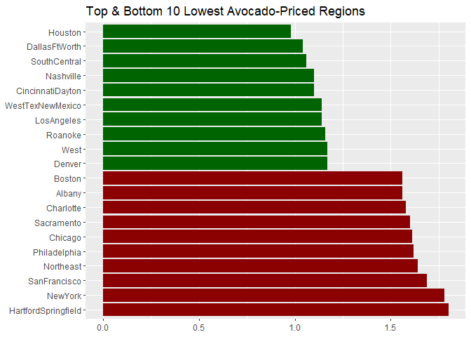
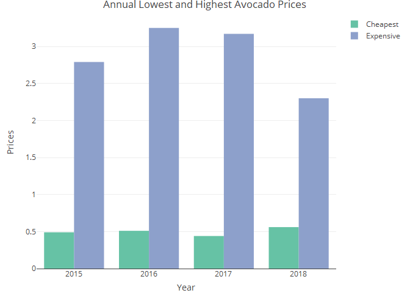
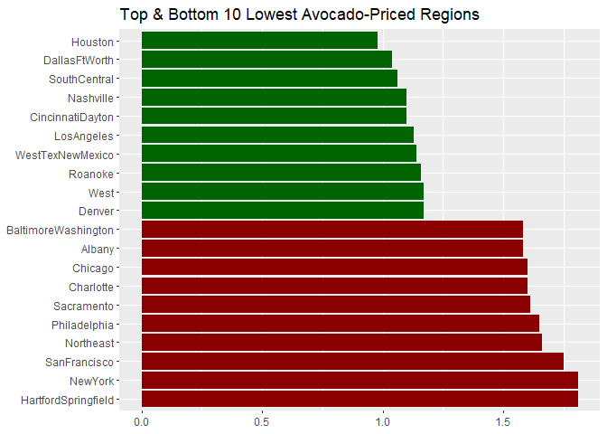

Avocado Prices Case Study
================
Leopoldine Mirtil

### Source

This analysis uses the [Avocado
Prices](https://www.kaggle.com/datasets/neuromusic/avocado-prices) data
set which was made publicly available by Justin Kiggins on Kaggle.com.
It contains historical data about avocado prices and sales throughout
the United States. The data was collected from the Hass Avocado Board
website in May 2018.

### Objective

The following tasks:

1.  Identify the cities that had the cheapest and most expensive prices
    per year
2.  Determine the average price and sales by type
3.  Find the top 10 cities with the overall lowest and highest prices
4.  Analyze the relationship between prices and quantity

## Import Data

### Step 1 - Import Data

#### Load Library

``` r
library(tidyr)
library(tidyverse)
library(dplyr)
library(knitr)
library(ggplot2)
library(lubridate)
library(plotly)
```

#### Set Directory & Import Data

``` r
df <- read.csv('avocado.csv')
```

### Step 2 - Clean Data

``` r
#drop index column
df <- df[-c(1)]

#change data type of date 
df$Date <- as.Date(df$Date)

#add Col
df$Sales = df$AveragePrice * df$Total.Volume

#rename cols 
df <- rename(df, TotalQuantity=Total.Volume, TotalBags=Total.Bags, SmallBags=Small.Bags, LargeBags=Large.Bags, 
             XLargeBags=XLarge.Bags, Type=type, Year=year, Region=region)

#remove PLU cols 
df <- df[-c(4:6)] 
```

### Step 3 - Inspect Data

#### Check for Missing/Null Values

``` r
sapply(df, function(x) sum(is.na(x)))
```

    ##          Date  AveragePrice TotalQuantity     TotalBags     SmallBags 
    ##             0             0             0             0             0 
    ##     LargeBags    XLargeBags          Type          Year        Region 
    ##             0             0             0             0             0 
    ##         Sales 
    ##             0

#### Check for Empty Values

``` r
sapply(df, function(x) sum(x==""))
```

    ##          Date  AveragePrice TotalQuantity     TotalBags     SmallBags 
    ##            NA             0             0             0             0 
    ##     LargeBags    XLargeBags          Type          Year        Region 
    ##             0             0             0             0             0 
    ##         Sales 
    ##             0

#### View Modified Dataframe

``` r
str(df)
```

    ## 'data.frame':    18249 obs. of  11 variables:
    ##  $ Date         : Date, format: "2015-12-27" "2015-12-20" ...
    ##  $ AveragePrice : num  1.33 1.35 0.93 1.08 1.28 1.26 0.99 0.98 1.02 1.07 ...
    ##  $ TotalQuantity: num  64237 54877 118220 78992 51040 ...
    ##  $ TotalBags    : num  8697 9506 8145 5811 6184 ...
    ##  $ SmallBags    : num  8604 9408 8042 5677 5986 ...
    ##  $ LargeBags    : num  93.2 97.5 103.1 133.8 197.7 ...
    ##  $ XLargeBags   : num  0 0 0 0 0 0 0 0 0 0 ...
    ##  $ Type         : chr  "conventional" "conventional" "conventional" "conventional" ...
    ##  $ Year         : int  2015 2015 2015 2015 2015 2015 2015 2015 2015 2015 ...
    ##  $ Region       : chr  "Albany" "Albany" "Albany" "Albany" ...
    ##  $ Sales        : num  85435 74084 109945 85312 65331 ...

### Step 4 - Analyze Data

#### Descriptive Analysis

``` r
summary(df)
```

    ##       Date             AveragePrice   TotalQuantity        TotalBags       
    ##  Min.   :2015-01-04   Min.   :0.440   Min.   :      85   Min.   :       0  
    ##  1st Qu.:2015-10-25   1st Qu.:1.100   1st Qu.:   10839   1st Qu.:    5089  
    ##  Median :2016-08-14   Median :1.370   Median :  107377   Median :   39744  
    ##  Mean   :2016-08-13   Mean   :1.406   Mean   :  850644   Mean   :  239639  
    ##  3rd Qu.:2017-06-04   3rd Qu.:1.660   3rd Qu.:  432962   3rd Qu.:  110783  
    ##  Max.   :2018-03-25   Max.   :3.250   Max.   :62505647   Max.   :19373134  
    ##    SmallBags          LargeBags         XLargeBags           Type          
    ##  Min.   :       0   Min.   :      0   Min.   :     0.0   Length:18249      
    ##  1st Qu.:    2849   1st Qu.:    127   1st Qu.:     0.0   Class :character  
    ##  Median :   26363   Median :   2648   Median :     0.0   Mode  :character  
    ##  Mean   :  182195   Mean   :  54338   Mean   :  3106.4                     
    ##  3rd Qu.:   83338   3rd Qu.:  22029   3rd Qu.:   132.5                     
    ##  Max.   :13384587   Max.   :5719097   Max.   :551693.7                     
    ##       Year         Region              Sales         
    ##  Min.   :2015   Length:18249       Min.   :     134  
    ##  1st Qu.:2015   Class :character   1st Qu.:   17164  
    ##  Median :2016   Mode  :character   Median :  139530  
    ##  Mean   :2016                      Mean   :  927948  
    ##  3rd Qu.:2017                      3rd Qu.:  514191  
    ##  Max.   :2018                      Max.   :54379912

#### Summary Statistics of Region Prices

``` r
df %>%
  group_by(Region) %>%
  summarise(MinPrice=min(AveragePrice),
            MeanPrice=round(mean(AveragePrice),2),
            MedianPrice = round(median(AveragePrice), 2),
            MaxPrice=max(AveragePrice)) %>%
  arrange(MinPrice) 
```

    ## # A tibble: 54 × 5
    ##    Region           MinPrice MeanPrice MedianPrice MaxPrice
    ##    <chr>               <dbl>     <dbl>       <dbl>    <dbl>
    ##  1 CincinnatiDayton     0.44      1.21        1.1      2.2 
    ##  2 PhoenixTucson        0.46      1.22        1.23     2.62
    ##  3 Detroit              0.48      1.28        1.23     2.08
    ##  4 Houston              0.51      1.05        0.98     1.92
    ##  5 Nashville            0.51      1.21        1.1      2.24
    ##  6 Columbus             0.52      1.25        1.18     2.22
    ##  7 WestTexNewMexico     0.52      1.26        1.14     2.93
    ##  8 LosAngeles           0.53      1.22        1.14     2.44
    ##  9 Jacksonville         0.54      1.51        1.47     2.99
    ## 10 LasVegas             0.54      1.38        1.27     3.03
    ## # ℹ 44 more rows

#### Annual Minimum & Maximum Prices

``` r
df %>%
  group_by(Year, Region) %>%
  summarise(PriceRange = range(AveragePrice), .groups="drop") %>%
  group_by(Year) %>%
  filter(PriceRange == range(PriceRange))
```

    ## # A tibble: 8 × 3
    ## # Groups:   Year [4]
    ##    Year Region           PriceRange
    ##   <int> <chr>                 <dbl>
    ## 1  2015 PhoenixTucson          0.49
    ## 2  2015 SanFrancisco           2.79
    ## 3  2016 PhoenixTucson          0.51
    ## 4  2016 SanFrancisco           3.25
    ## 5  2017 CincinnatiDayton       0.44
    ## 6  2017 Tampa                  3.17
    ## 7  2018 Houston                0.56
    ## 8  2018 SanFrancisco           2.3

#### Top 10 Regions by Cheapest Price

``` r
df %>%
aggregate(cbind(AveragePrice, TotalQuantity, Sales) ~ Region, min) %>%
rename (MinPrice = AveragePrice,
        Quantity = TotalQuantity) %>%
arrange(MinPrice) %>%
slice(1:10)
```

    ##              Region MinPrice Quantity     Sales
    ## 1  CincinnatiDayton     0.44  6349.77 10136.355
    ## 2     PhoenixTucson     0.46  4881.79  9665.944
    ## 3           Detroit     0.48  4973.92  8327.510
    ## 4           Houston     0.51  7442.68  9526.860
    ## 5         Nashville     0.51  2892.29  4561.680
    ## 6          Columbus     0.52  2002.61  3344.359
    ## 7  WestTexNewMexico     0.52  4582.72  9419.022
    ## 8        LosAngeles     0.53 28062.63 46371.605
    ## 9      Jacksonville     0.54  1140.32  2143.802
    ## 10         LasVegas     0.54  2988.40  6873.320

#### Top 5 Regions with Frequently Cheap Prices Per Year

``` r
#create mode function
mode_func <- function(x) {
  u <- unique(x)
  tab <- tabulate(match(x, u))
  u[tab == max(tab)]
}

df %>%
  group_by(Year, Region) %>%
  reframe(CommonPrice= mode_func(AveragePrice)) %>%
  arrange(Year, Region, CommonPrice) %>%
  group_by(Year, Region) %>%
  slice_head(n=1) %>%
  arrange(Year, CommonPrice) %>%
  group_by(Year) %>%
  slice(1:5) 
```

    ## # A tibble: 20 × 3
    ## # Groups:   Year [4]
    ##     Year Region           CommonPrice
    ##    <int> <chr>                  <dbl>
    ##  1  2015 PhoenixTucson           0.56
    ##  2  2015 WestTexNewMexico        0.74
    ##  3  2015 Houston                 0.79
    ##  4  2015 DallasFtWorth           0.8 
    ##  5  2015 SouthCentral            0.83
    ##  6  2016 PhoenixTucson           0.64
    ##  7  2016 DallasFtWorth           0.69
    ##  8  2016 WestTexNewMexico        0.73
    ##  9  2016 LosAngeles              0.76
    ## 10  2016 West                    0.78
    ## 11  2017 CincinnatiDayton        0.64
    ## 12  2017 PhoenixTucson           0.65
    ## 13  2017 Houston                 0.83
    ## 14  2017 WestTexNewMexico        0.84
    ## 15  2017 DallasFtWorth           0.9 
    ## 16  2018 PhoenixTucson           0.59
    ## 17  2018 DallasFtWorth           0.77
    ## 18  2018 California              0.8 
    ## 19  2018 Nashville               0.8 
    ## 20  2018 WestTexNewMexico        0.88

#### Top and Bottom 10 Regions by Median Prices

``` r
df %>%
  group_by(Region) %>%
  reframe(MedianPrice= round(median(AveragePrice), 2)) %>%
  arrange(MedianPrice) %>%
  slice(unique(c(1:10, n() - 9:0))) 
```

    ## # A tibble: 20 × 2
    ##    Region              MedianPrice
    ##    <chr>                     <dbl>
    ##  1 Houston                    0.98
    ##  2 DallasFtWorth              1.04
    ##  3 SouthCentral               1.06
    ##  4 CincinnatiDayton           1.1 
    ##  5 Nashville                  1.1 
    ##  6 LosAngeles                 1.14
    ##  7 WestTexNewMexico           1.14
    ##  8 Roanoke                    1.16
    ##  9 Denver                     1.17
    ## 10 West                       1.17
    ## 11 Albany                     1.56
    ## 12 Boston                     1.56
    ## 13 Charlotte                  1.58
    ## 14 Sacramento                 1.6 
    ## 15 Chicago                    1.61
    ## 16 Philadelphia               1.62
    ## 17 Northeast                  1.64
    ## 18 SanFrancisco               1.69
    ## 19 NewYork                    1.78
    ## 20 HartfordSpringfield        1.8

#### Average Price and Sales by Type

``` r
df %>%
  group_by(Type) %>%
  summarise(AvgPrice = round(mean(AveragePrice),2), 
            AverageSales = mean(Sales)) %>%
  arrange(AvgPrice)
```

    ## # A tibble: 2 × 3
    ##   Type         AvgPrice AverageSales
    ##   <chr>           <dbl>        <dbl>
    ## 1 conventional     1.16     1781013.
    ## 2 organic          1.65       74604.

### Step 5 - Visualizations

<!-- -->

<!-- -->

<!-- -->
